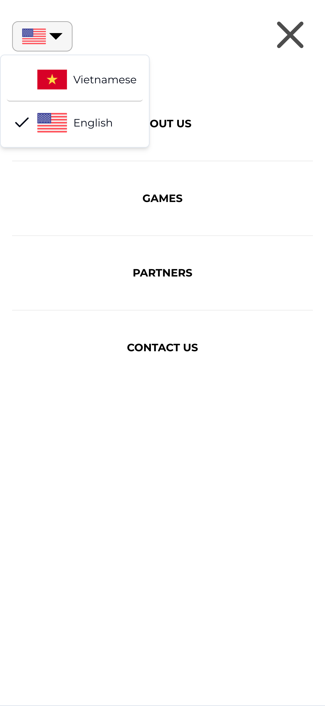

# NEXTJS 15 + TypeScript + TailwindCSS + Shadcn UI

# Link preview: https://4tek-test-eight.vercel.app/

# How to install & run project

1. **Install dependencies:**
   Make sure you have Node.js installed. Then run:

   ```bash
   npm install
   ```

2. **Run the development server:**
   ```bash
   npm run dev
   ```

# Capture website's images

1. Desktop view (English)
   

2. Desktop view (Vietnamese)
   

3. Mobile menu (Iphone 14 Pro Max)
   

4. Mobile view (Iphone 14 Pro Max)
   
